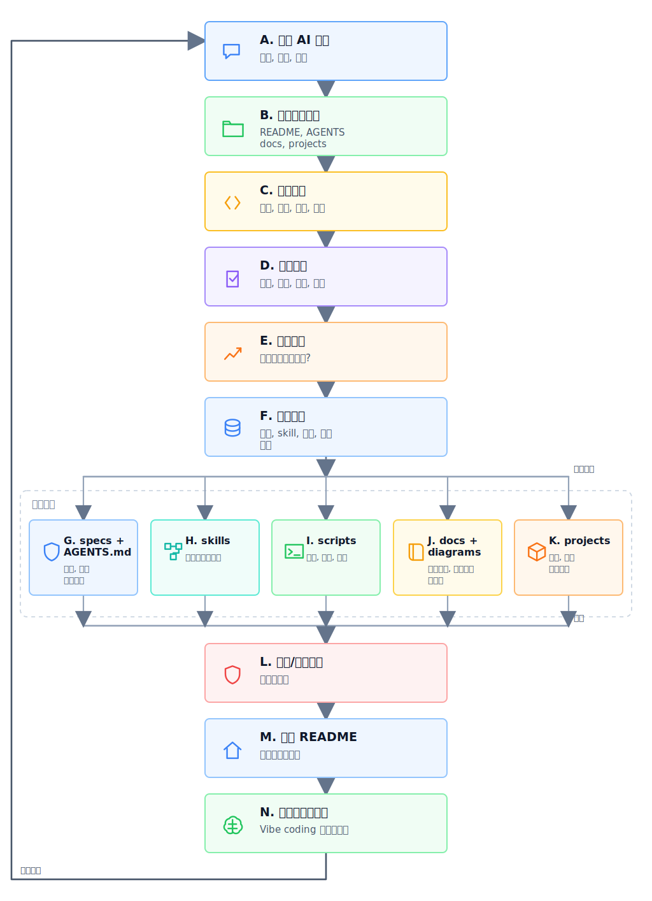

# Sirius Coding Evolution Station

> 一个把工作方式、项目经验、发布证据、审查标准和自动化检查持续沉淀为可复用资产的进化式开发工作站。
>
> An evolving development station that turns workflow, project experience, release evidence, review standards, and automation checks into reusable assets.

<p align="center">
  
</p>

<p align="left">
  
  
  
  
  
  
</p>

<p align="center">
  <a href="#核心定位">核心定位</a> ·
  <a href="#control-layer-os">Control Layer OS</a> ·
  <a href="#采用入口">采用入口</a> ·
  <a href="#进化闭环">进化闭环</a> ·
  <a href="#进化流程图">进化流程图</a> ·
  <a href="#核心资产">核心资产</a> ·
  <a href="#版本与模板库">版本与模板库</a> ·
  <a href="#母仓与模板">母仓与模板</a> ·
  <a href="#项目执行层">项目执行层</a> ·
  <a href="#安全边界">安全边界</a> ·
  <a href="#许可证">许可证</a>
</p>

## 核心定位

这个仓库不只是 GitHub 主页，也不只是项目合集。它是 `sirius-coding` 的公开工作站根仓库，负责把长期有效的协作方式显式化、资产化、可检查化。

This repository is not only a GitHub profile README and not only a project collection. It is the public workspace root for `sirius-coding`, designed to make durable collaboration patterns explicit, reusable, and auditable.

| 层级 / Layer | 职责 / Responsibility |
| --- | --- |
| 根仓库 / Root workspace | 规则、强记忆、共享 skill、审查标准、发布模型、公开/私有边界 |
| 项目层 / Project layer | 业务实现、测试、构建、部署、项目级文档和发布质量 |
| 进化层 / Evolution layer | 每次任务结束后沉淀经验、抽取流程、补齐护栏、推进自动化 |

## Control Layer OS

本仓库的 v4 主线是把进化式工作站产品化为 **Control Layer OS**：围绕 AI 辅助开发建立一层可复用控制层，让规则、强记忆、审查标准、公开边界、图形能力、发布证据、模板同步和自动化审计成为仓库资产。

Control Layer OS 不替代业务项目。它管理业务项目之外的“如何工作、如何验证、如何沉淀、如何公开、如何同步模板”。

## 采用入口

如果你要从模板创建新的工作站，先读：

1. [Quick Start](./docs/adoption/quick-start.md)
2. [Why This Template](./docs/adoption/why-this-template.md)
3. [Mother Repository Relationship](./docs/adoption/mother-repo-relationship.md)
4. [Control Layer OS](./specs/workspace/control-layer-os.md)
5. [Minimal Project Layout](./examples/minimal-project-layout/README.md)

外部协作入口：

- [Contributing](./CONTRIBUTING.md)
- [Security](./SECURITY.md)
- [PR Template](./.github/pull_request_template.md)
- [Issue Templates](./.github/ISSUE_TEMPLATE)

## 进化闭环

本工作站围绕五个动作持续演进：

1. **主动记忆**：把长期规则写入仓库，而不是留在一次会话中。
2. **主动复用**：把重复流程升级为 `skills/`、模板或脚本。
3. **主动护栏**：在发布、同步、改结构、公开文档前做边界检查。
4. **主动验证**：用测试、构建、静态扫描和烟测证据支撑结论。
5. **主动复盘**：每次任务输出 `Evolution`，判断哪些经验应继续沉淀。

## 进化流程图

这张图描述的是工作站的进化能力：一次开发对话不会只停留在聊天窗口，而会经过实现、验证、复盘和知识分流，最终沉淀成规则、skill、脚本、文档、图表和项目资产。

<p align="center">
  
</p>

这张图由 [intent](./docs/diagrams/evolution-workflow.intent.json)、[layout plan](./docs/diagrams/evolution-workflow.layout.plan.json)、[SVG](./docs/diagrams/evolution-workflow.svg) 和 [image prompt](./docs/diagrams/evolution-workflow.image-prompt.md) 共同维护。

## 核心资产

| 资产 / Asset | 说明 / Description |
| --- | --- |
| [AGENTS.md](./AGENTS.md) | 根仓库代理规则，定义事实源优先级、根/项目边界、护栏和输出结构 |
| [VERSION](./VERSION) | 当前工作站控制层版本号 |
| [CHANGELOG](./CHANGELOG.md) | 按 SemVer 维护的版本历史 |
| [Contributing](./CONTRIBUTING.md) | 外部贡献边界、验证要求和 PR 描述建议 |
| [Security](./SECURITY.md) | 公开仓库安全策略和私有 overlay 处理规则 |
| [Release History](./docs/releases/release-history.md) | 版本治理、模板同步和发布边界 |
| [Template Manifest](./docs/template/template-manifest.yaml) | 模板库同步范围，明确哪些根资产可进入模板 |
| [Control Layer OS](./specs/workspace/control-layer-os.md) | AI 时代软件工程控制层定义 |
| [Evolution Handbook](./specs/workspace/evolution-handbook.md) | 进化手册全文持久化版本，是本工作站的核心目标说明 |
| [Adoption Docs](./docs/adoption/quick-start.md) | 模板采用、定位解释和母仓关系说明 |
| [Minimal Project Layout](./examples/minimal-project-layout/README.md) | 新工作站最小项目布局示例 |
| [Workspace Opening Model](./docs/ops/workspace-opening-model.md) | 项目加入、发布形态和目录契约 |
| [Core Assets Map](./specs/workspace/core-assets-map.md) | 核心文件和目录的中文/英文双语索引 |
| [Public / Private Boundary](./specs/workspace/public-private-boundary.md) | 公开仓库脱敏规则和私有覆盖文件约定 |
| [Code Review Standard](./specs/review/code_review.md) | 默认代码审查标准 |
| [Environment Registry](./docs/ops/environment-registry.yaml) | 公开环境模型，真实环境值不进入仓库 |
| [Private Registry Example](./docs/ops/environment-registry.private.example.yaml) | 私有环境登记示例，复制后填入本地忽略文件 |
| [Cloud Deploy Checklist](./docs/sirius-xz-agent-cloud-deploy-checklist.md) | 云端发布与联调检查清单 |
| [Reusable Delivery Skill](./skills/workspace-multi-env-delivery/SKILL.md) | 多环境交付、独立仓库发布和部署排障复用流程 |
| [Template Adoption Skill](./skills/template-adoption/SKILL.md) | 使用模板创建新工作站的复用流程 |
| [Root Repo Audit Script](./scripts/root-repo-structure-audit.sh) | 根仓库结构和公开脱敏检查脚本 |
| [Template Sync Script](./scripts/template/sync-template-repo.sh) | 从当前工作站生成模板库快照，并排除业务项目实现 |
| [Root Audit Workflow](./.github/workflows/root-audit.yml) | push / PR 时运行 strict 根审计 |
| [Template Sync Workflow](./.github/workflows/sync-template.yml) | 母仓 main 更新后向模板仓创建同步 PR |
| [Diagram Capability](./docs/diagrams/README.md) | intent -> layout -> SVG / image prompt 的高质量流程图生成链路 |
| [Independent Repo Alignment](./specs/workspace/independent-repo-alignment.md) | 独立仓库与根工作站目标对齐标准 |
| [Module Roadmap](./specs/workspace/module-roadmap.md) | 根模块和子项目模块的持续完善路线 |
| [GitHub Project Roadmap](./docs/ops/github-project-roadmap.md) | 根工作站迭代看板模型和初始化脚本说明 |

## 版本与模板库

当前控制层版本是 [`4.0.0`](./VERSION)。根工作站按 SemVer 维护：大版本代表工作站运行模型或模板边界变化，小版本代表新增可复用能力，补丁版本用于文档、脚本或检查修正。

模板库用于复制本工作站的可复用控制层，不包含当前仓库的业务实现。大版本稳定后，从当前仓库同步到 `sirius-coding/sirius-evolution-station-template`：

```bash
./scripts/template/sync-template-repo.sh \
  --output /tmp/sirius-evolution-station-template \
  --pr
```

同步范围由 [Template Manifest](./docs/template/template-manifest.yaml) 定义。`projects/`、根 `pom.xml`、项目级部署清单和私有环境覆盖文件不会进入模板库。

## 母仓与模板

`sirius-coding/sirius-coding` 是母仓，负责真实演进、验证和业务项目承载。`sirius-coding/sirius-evolution-station-template` 是模板仓，只接收可复用根控制层资产。

同步方向固定为：

```text
mother repo -> export snapshot -> template audit -> sync PR -> template CI
```

直接修改模板仓只适用于紧急修复或仓库管理事项。常规能力升级应先在母仓验证，再通过同步 PR 进入模板仓。

## 项目执行层

`projects/` 下的子项目保留实现职责，根仓库只沉淀跨项目可复用方法。

| 项目 / Project | 方向 / Direction |
| --- | --- |
| [sirius-xz-agent](./projects/sirius-xz-agent) | Spring AI Alibaba / DeepSeek / pgvector / RAG / Agent 样板 |
| [sirius-xz-agent-ui](./projects/sirius-xz-agent-ui) | 面向 Agent 的前端控制台 |
| [sirius-cloud-starter](./projects/sirius-cloud-starter) | Spring Cloud Alibaba 微服务起步骨架 |
| [sirius-web-toolkit](./projects/sirius-web-toolkit) | Web 微服务公共能力组件 |

## 安全边界

这个仓库按公开仓库维护。可公开沉淀结构、流程、模板、匿名化拓扑和检查项；不公开真实服务器账号、凭证、密钥、精确私有主机、敏感路径和登录细节。

真实环境值应放在本地忽略文件：

```bash
cp docs/ops/environment-registry.private.example.yaml docs/ops/environment-registry.private.yaml
```

## 本地检查

```bash
./scripts/root-repo-structure-audit.sh
./scripts/root-repo-structure-audit.sh --strict
```

该脚本检查必备控制层文件、README 本地链接、YAML/TOML 可解析性、版本一致性、图形输出漂移、私有环境文件未被追踪，以及公开资产中是否出现已知敏感值。`--strict --json` 可供 CI 或自动同步流程使用。

## 许可证

本仓库当前采用 [Apache License 2.0](./LICENSE)。未来商业化边界见 [COMMERCIALIZATION.md](./COMMERCIALIZATION.md)。

Sirius 名称、品牌方向和视觉标识按 [NOTICE](./NOTICE) 中的品牌边界说明使用。

## 当前主线

1. 让进化手册成为仓库强记忆。
2. 让 README 成为进化式工作站的公开入口。
3. 让根仓库结构、公开/私有边界和发布资产可审计。
4. 逐步把重复检查升级为脚本、workflow，再考虑插件化。
5. 将 Control Layer OS 产品化为可采用、可审计、可同步、可贡献的模板基线。
